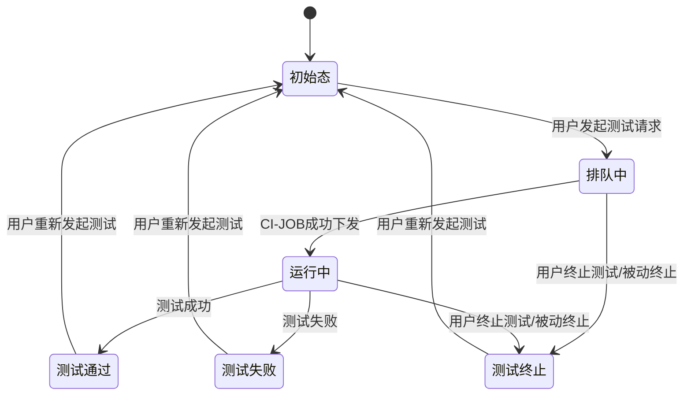
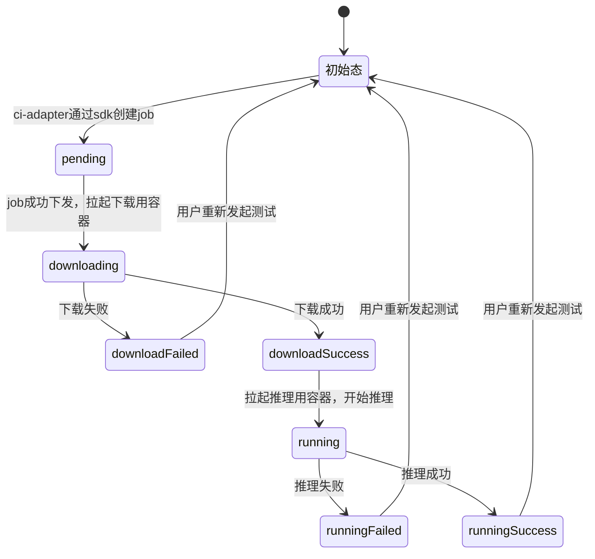
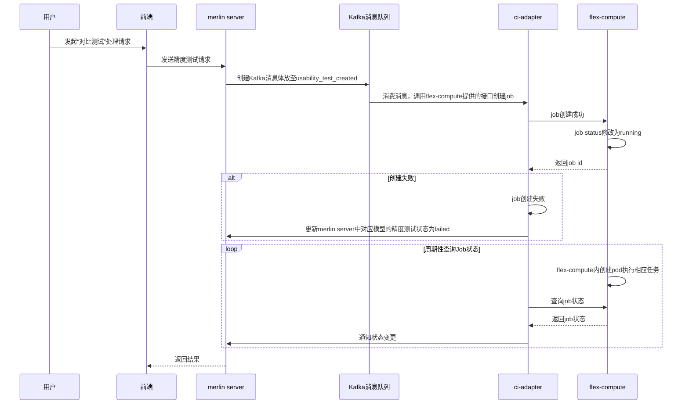
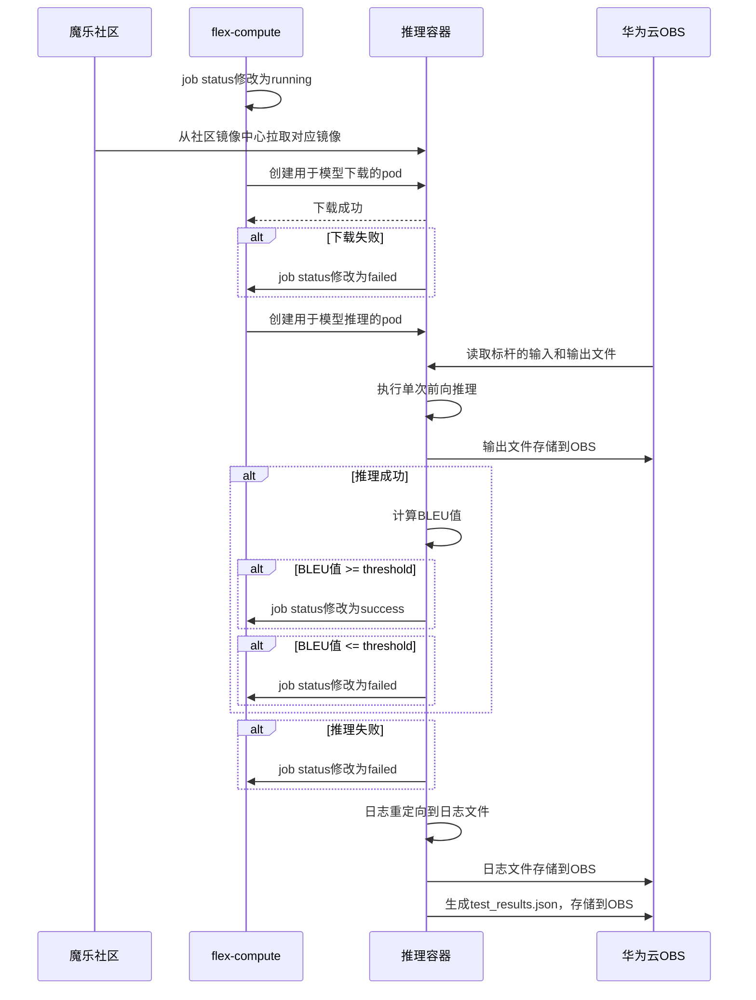
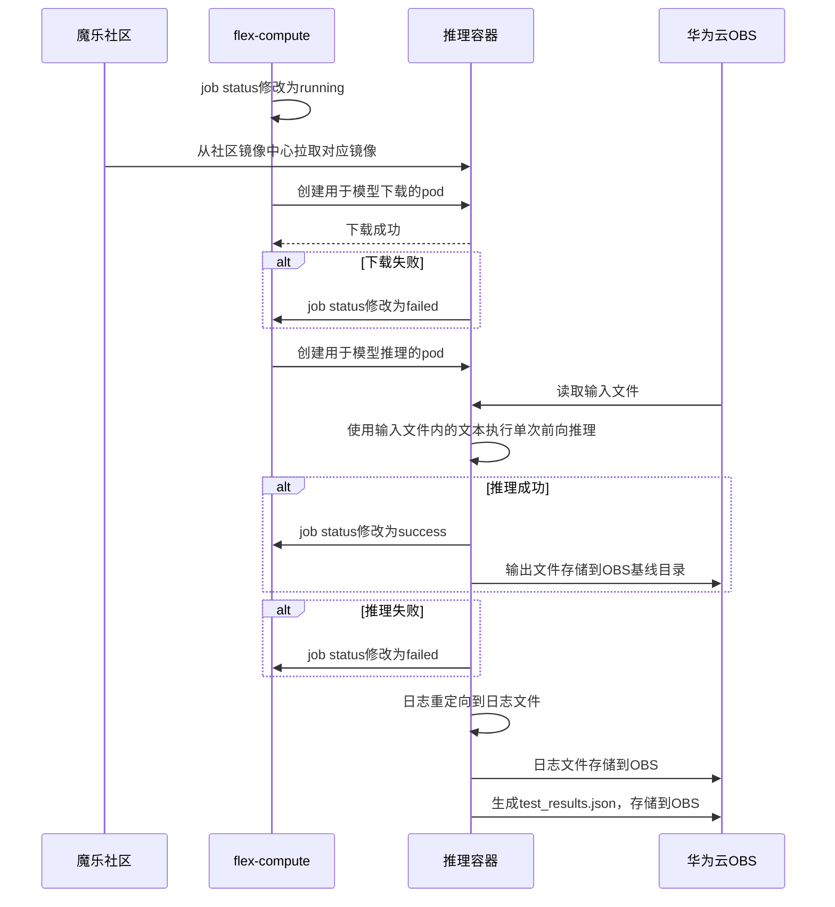
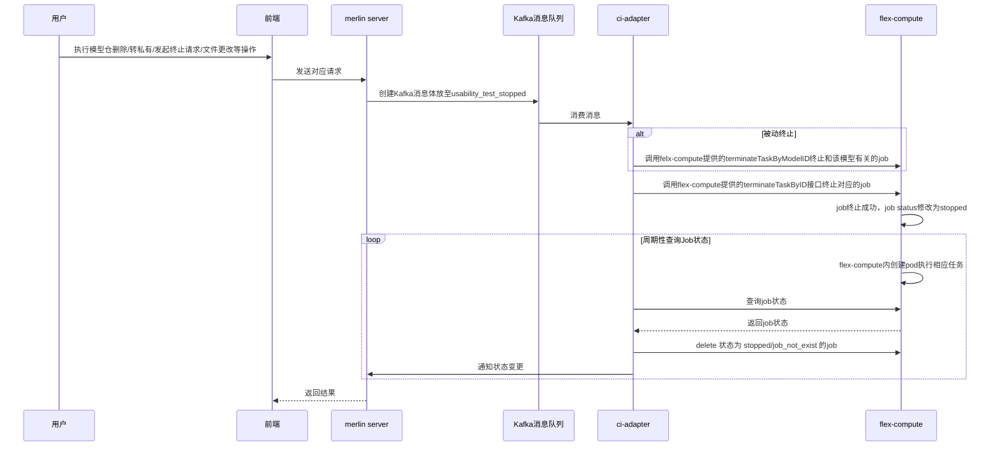

# 概述

## 目的
<!-- ### 【关键内容】 -->
精度测试支持基于用户导入的GPU基线数据进行比对测试，支持推理输出比对，支持NPU上测试作为极限运行生成新基线，且针对不同规模的模型支持**单机多卡**分布式训推支持。精度测试和可用性测试均作为基础的测试策略，支持通过测试的策略组合，进行生态模型、精品模型的多样性测试组合。

## 范围


# 特性/功能实现原理

<!-- 【关键内容】
设计需求来源于《系统需求分析说明书》，《架构设计说明书》，《系统设计说明书》

【参考信息】
可以参考《系统设计说明书》 -->

## 总体方案

<!-- 主要阐述该特性的详细设计，选择什么器件，算法，架构如何布局，打算UI如何呈现，希望获取什么用户信息支撑后续设计等

从整体处理流程上来看，XX特性包含多个关键场景，根据场景分析和系统分解，XXX特性涉及一下X个子系统：... , ... , ...算法，UI界面

定义设计原则、对接原则

系统架构描述


方案整体架构图 -->


## 特性功能性设计

<!-- 描述该功能/特性设计的整体思路，包括如何划分至当前USe Case的，划分的依据，理由。特性的整体Use Case图，下面各章节针对每个Use Case进行时序分析与分解分配


功能/特性设计过程说明，系与上下游活动的关系，以及设计各活动顺序：
1.输出实体关系分布图
2.输出Use Case时序图（主，扩展场景各一个）
3.模块接口定义
模块接口定义输出模块接口列表、模块依赖图
4.Story划分/依赖分析（与3同步进行）：
Story划分/依赖输出Story列表，依赖关系图
5.输出每个模块的类图
6.输出Story的时序图、类图 -->


## XXX Use Case 实现

<!-- 主要在Use Case描述的基础上抽取出Boundary、Control、Entity，并以时序图的形式表现其交互过程，后续将以此为依据，识别特性设计与Story的分解关系，为后续Story设计提供依据，描述性信息可以参考Use Case描述文档。 -->

### 设计思路

<!-- 说明Use Case实现的思路 -->

### 实体关系分析


### 实现分析


## Story 划分及依赖分析（Use Case 分解为 Story）

## 模块设计

### 分配模块接口职责（optional）

### 模块接口定义

## Story 设计

### 类设计

### 实现设计

## 特性下的非功能需求设计


# 前端状态机



# flex-compute 单个job状态机

### 推理失败原因包含：

- 对比测试
  - 推理脚本或模型问题导致的单次前向推理失败
  - 虽然单次前向推理成功，但是与标杆对比后低于评估标准
- 基线测试
  - 推理脚本或模型问题导致的单次前向推理失败




## Kafka消息接口更改

**原有的模型可用性认证消息命名由 model_ci_created, model_ci_stopped修改为usability_test_created, usability_test_stopped**

accuracy_test_created消息新增字段

| 字段名                   | 类型   | 描述                                                         | 示例值                             | 是否必选 |
| ------------------------ | ------ | ------------------------------------------------------------ | ---------------------------------- | :------: |
| test_type                | string | 区分测试类型（如可用性测试、精度测试）                       | "accuracy_test" \|"usability_test" |    是    |
| model_test_type          | string | 区分基础测试类型（推理或训练）                               | "inference"  \|"training"          |    是    |
| model_template           | string | 精度测试执行所需的模型模板                                   | 见约束对应章节                     |    否    |
| dataset_id               | string | 训练精度测试关联的数据集信息，用于下载数据集                 | "dataset_abc"                      |    否    |
| baseline_id              | string | 训练关联的基线id                                             | "baseline123"                      |    是    |
| input_file_path          | string | 推理精度测试输入文本文件的路径，用于推理测试                 | "/path/to/input.txt"               |    否    |
| ~~baseline_output_file~~ | string | 精度测试基线输出文本文件/loss文件的路径，用于对比测试        | "/path/to/baseline_output.txt"     |    否    |
| ~~baseline_dir_path~~    | string | 已有/预创建的基线目录路径，用于subpath挂载                   | "/path/to/baseline_dir"            |    否    |
| ~~result_dir_path~~      | string | 测试任务的结果目录路径，用于subpath挂载，用于容器存储测试结果物料 | "/path/to/result_dir"              |    是    |
| ~~metric~~               | string | 使用的评估指标                                               | BLEU、绝对误差                     |    是    |
| ~~threshold~~            | float  | 通过测试的阈值                                               | 0.85                               |    否    |
| ~~operator~~             | string | 用于比较的操作符                                             | >=, <=                             |    是    |
|                          |        |                                                              |                                    |          |
|                          |        |                                                              |                                    |          |


accuary_test_stopped消息新增字段（似乎不需要新增字段）


## 内存数据结构体字段修改

**用于模型可用性认证的内存相关的结构体 ModelInfo**  ~~修改为 UsabilityModelInfo~~

~~新增用于精度测试的内存相关结构体 AccuracyModelInfo~~


当前设计和模型可用性测试共用同一个内存数据结构体

#### ModelInfo结构体原有参数

| 字段名           | 类型       | 描述                     | 示例值                                                       | 是否必选 |
| ---------------- | ---------- | ------------------------ | ------------------------------------------------------------ | -------- |
| ID               | int64      | 唯一任务ID               |                                                              | 是       |
| Owner            | string     | 模型Owner                | ModelOwner                                                   | 是       |
| ModelName        | string     | 模型名字                 | ModelName-7B                                                 | 是       |
| ModelID          | Int64      | 模型ID                   |                                                              | 是       |
| ImageName        | string     | 精度测试使用的基础镜像   | openeuler-python3.10-cann8.0.rc2.beta1-pytorch2.1.0-openmind0.9.0 | 是       |
| GitURL           | string     | 模型的URL                | https://modelers.cn/ModelOwner/ModelName.git                 | 是       |
| TestStatus       | string     | 测试状态                 | running, pending, etc...                                     | 是       |
| StatusConfirmed  | bool       |                          |                                                              | 是       |
| LastUpdated      | string     |                          |                                                              |          |
| HardwareVersion  | string     | 硬件信息                 | NPU                                                          | 是       |
| Framework        | string     | 框架信息                 | pytorch                                                      | 是       |
| FrameworkVersion | string     | 框架版本                 | 2.1.0                                                        | 是       |
| CannVersion      | string     | Cann版本                 | 8.0.rc1.beta1                                                | 是       |
| CommitID         | string     | 模型仓的commit ID        | 239f776                                                      | 是       |
| IsRepoDeleted    | bool       | 判断Repo是否被删除的标志 | True/False                                                   | 是       |
| CITask           | CITaskInfo |                          |                                                              | 是       |
| NumComputeCards  | int        | 精度测试所需卡数         | 1，2，4，8                                                   | 是       |
|                  |            |                          |                                                              |          |
|                  |            |                          |                                                              |          |


#### ModelInfo结构体新增字段

| 字段名        | 类型   | 描述                                   | 示例值                             | 是否必选 |
| ------------- | ------ | -------------------------------------- | ---------------------------------- | -------- |
| TestType      | string | 区分测试类型（如可用性测试、精度测试） | "accuracy_test" \|"usability_test" | 是       |
| ModelTestType | string | 区分基础测试类型（推理或训练）         | "inference"  \|"training"          | 是       |
| RunAsBaseLine | bool   | 当前任务是否作为基线运行的标志         | True/False                         | 是       |
| ModelTemplate | string | 模型Template                           | qwen, internal, etc...             | 否       |
| DatasetName   | string | 精度训练所用的数据集名称               | alpace-demo                        | 否       |
| Metric        | string | 使用的评估指标                         | BLEU、绝对误差                     | 否       |
| Threshold     | float  | 通过测试的阈值                         | 0.85                               | 否       |
| Operator      | string | 用于比较的操作符                       | >=, <=                             | 是       |
| BaseLineName  | string | 用于对比的基线名称                     | qwen2-0.5b-baseline2               | 否       |
|               |        |                                        |                                    |          |


#### CITaskInfo结构体原有参数

| 字段名    | 类型   | 描述                           | 示例值                   | 是否必选 |
| --------- | ------ | ------------------------------ | ------------------------ | -------- |
| Status    | string | 获取模型在flex-compute上的状态 | running, success, etc... | 否       |
| JobID     | string | K8s上对应的JobID               |                          | 是       |
| ReportURL | string | 日志文件路径                   |                          | 否       |
|           |        |                                |                          |          |
|           |        |                                |                          |          |


#### CITaskInfo结构体新增参数

| 字段名         | 类型   | 描述                           | 示例值                     | 是否必选 |
| -------------- | ------ | ------------------------------ | -------------------------- | -------- |
| NewBaseLineURL | string | 基线URL                        | obs URL                    | 否       |
| TestResultURL  | string | test_result.json文件URL        | obs URL                    | 否       |
| OutputURL      | string | 推理输出文件URL                | obs URL                    | 否       |
| MetricValue    | float  | 使用对应评估输出的得分         | 0.85                       | 否       |
| Passed         | bool   | 用于判断对比测试是否通过的标志 | True/False                 | 否       |
| Stage          | string | 测试处在的阶段                 | pending/download/inference | 否       |
|                |        |                                |                            |          |
|                |        |                                |                            |          |
|                |        |                                |                            |          |


## 通知merlin server模型状态变更

#### 和模型可用性测试共用UpdateModelCI结构体

#### UpdateModelCI结构体

| 字段名           | 类型   | 描述                      | 示例值 | 是否必选 |
| ---------------- | ------ | ------------------------- | ------ | -------- |
| Id               | int64  | 任务id                    |        | 是       |
| ModelId          | int64  | 数据库内模型自增id        |        | 是       |
| CommitId         | string | commit id                 |        | 是       |
| CiStatus         | string | ci状态                    |        | 是       |
| ResultURL        | string | 日志URL（模型可用性测试） |        | 否       |
| ExternalArgsInfo | string | 一个结构体                |        | 是       |


#### ExternalArgsInfo原有字段

| 字段名          | 类型   | 描述                      | 示例值                 | 是否必选 |
| --------------- | ------ | ------------------------- | ---------------------- | -------- |
| ImageName       | string | 镜像名称                  |                        | 是       |
| JobID           | string | job id                    |                        | 是       |
| Status          | string | ci状态                    | running/success/failed | 是       |
| ReportURL       | string | 日志URL（模型可用性测试） |                        | 否       |
| StatusConfirmed | bool   | 状态确认位                |                        | 是       |
|                 |        |                           |                        |          |


#### ExternalArgsInfo新增字段

| 字段名      | 类型   | 描述                                           | 示例值                     | 是否必选 |
| ----------- | ------ | ---------------------------------------------- | -------------------------- | -------- |
| Stage       | string | 任务阶段                                       | pending/download/inference | 是       |
| OutputURL   | string | 推理输出文件路径                               | obs URL                    | 否       |
| LogURL      | string | 日志路径                                       | obs URL                    | 否       |
| Passed      | bool   | 精度测试是否通过                               | True/False                 | 否       |
| MetricValue | float  | 对比测试时，计算得到的指标值（仅对比测试需要） | 0.85                       | 否       |
| UpdatedDate | date   | 更新时间                                       |                            | 是       |
|             |        |                                                |                            |          |
|             |        |                                                |                            |          |


# 发起推理精度测试

## 前端/merlin server/kafka/ci-adapter/flex-compute之间的交互

#### 发起精度测试流程概述：

1. 用户发起测试的处理请求
2. 前端向merlin server发起精度测试请求
3. merlin通过Kafka发送消息
4. ci-adapter消费Kafka消息，调用flex-compute暴露的job create接口创建job，创建成功返回值包含job id。若失败，直接更新merlin中对应模型的精度测试状态为failed
5. ci-adapter周期性查询内存中保存的job的状态，得到job状态后，通知merlin状态变更
6. merlin返回结果给前端





## flex-compute/obs/社区之间的交互

### 大致流程

1. 容器启动

   - 获取环境变量:
     - MODEL_OWNER: 模型拥有者
     - MODEL_NAME: 模型名称
     - MODEL_TEMPLATE: 模型模版
     - INPUT_FILE_PATH: 输入文本文件路径
     - BASELINE_OUTPUT_FILE: 基准输出文件

2. 下载模型

   - 使用openmind-hub sdk，根据MODEL_OWNER和MODEL_NAME下载模型到本地路径
   - 下载输入文本文件

3. 执行推理

   - 对比测试

     - 读取环境变量中的INPUT_FILE_PATH，将文件内容作为输入

     - 使用openmind-cli执行单次前向推理

     - 计算推理输出文本与基线输出文本的BLEU值，并与阈值比较判断测试是否通过

     - 将输出文本存入OBS对应的基线目录

   - 基线测试

     - 读取环境变量中的INPUT_FILE_PATH，将文件内容作为输入

     - 使用openmind-cli执行单次前向推理

4. 日志处理

   - 推理过程中的打屏日志重定向到文件
   - 生成test_results.json文件
   - 将日志文件和test_result.json文件上传至OBS


```json
# test_result.json sample
# comparison_datails字段当"is_comparison_test": true 时才会存在
{
  "baseline_id": "baseline_123",
  "is_comparison_test": true,
  "test_type": "inference",
  "stage": "test",
  "output": "output.txt",
  "log": "execution.log",
  "passed": true,
  "comparison_details": {
    "metric": "BLEU",
    "metric_value": 0.85,
    "threshold": 0.80,
    "operator": ">=",
  }
}
```


对比测试




作为基准测试




## 终止推理精度测试（涵盖发起终止请求/模型仓删除/转私有/文件更改）

#### 流程概述：

1. 用户主动发起终止精度测试的处理请求/被动发起终止的请求
2. 前端向merlin server发起终止请求
3. merlin通过Kafka发送消息
4. ci-adapter消费Kafka消息
   - 主动终止
     - 调用flex-compute暴露的job create接口根据job id终止对应的job
   - 被动终止
     - 调用相关接口终止和该模型有关的job

5. ci-adapter周期性查询内存中保存的job的状态，得到job状态后，通知merlin状态变更
6. merlin返回结果给前端





