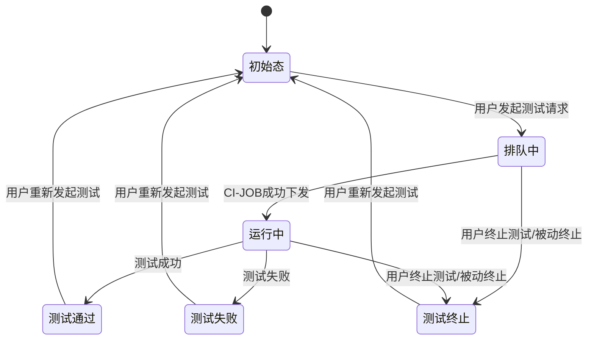

# 概述

## 目的
<!-- ### 【关键内容】 -->
精度测试支持基于用户导入的GPU基线数据进行比对测试，支持推理输出比对，支持NPU上测试作为极限运行生成新基线，且针对不同规模的模型支持**单机多卡**分布式训推支持。精度测试和可用性测试均作为基础的测试策略，支持通过测试的策略组合，进行生态模型、精品模型的多样性测试组合。

## 范围

# 特性/功能实现原理

<!-- 【关键内容】
设计需求来源于《系统需求分析说明书》，《架构设计说明书》，《系统设计说明书》

【参考信息】
可以参考《系统设计说明书》 -->

## 总体方案

<!-- 主要阐述该特性的详细设计，选择什么器件，算法，架构如何布局，打算UI如何呈现，希望获取什么用户信息支撑后续设计等

从整体处理流程上来看，XX特性包含多个关键场景，根据场景分析和系统分解，XXX特性涉及一下X个子系统：... , ... , ...算法，UI界面

定义设计原则、对接原则

系统架构描述

方案整体架构图 -->

## 特性功能性设计

<!-- 描述该功能/特性设计的整体思路，包括如何划分至当前USe Case的，划分的依据，理由。特性的整体Use Case图，下面各章节针对每个Use Case进行时序分析与分解分配

功能/特性设计过程说明，系与上下游活动的关系，以及设计各活动顺序：
1.输出实体关系分布图
2.输出Use Case时序图（主，扩展场景各一个）
3.模块接口定义
模块接口定义输出模块接口列表、模块依赖图
4.Story划分/依赖分析（与3同步进行）：
Story划分/依赖输出Story列表，依赖关系图
5.输出每个模块的类图
6.输出Story的时序图、类图 -->

## XXX Use Case 实现

<!-- 主要在Use Case描述的基础上抽取出Boundary、Control、Entity，并以时序图的形式表现其交互过程，后续将以此为依据，识别特性设计与Story的分解关系，为后续Story设计提供依据，描述性信息可以参考Use Case描述文档。 -->

### 设计思路

<!-- 说明Use Case实现的思路 -->

### 实体关系分析

### 实现分析

## Story 划分及依赖分析（Use Case 分解为 Story）

## 模块设计

### 分配模块接口职责（optional）

### 模块接口定义

## Story 设计

### 类设计

### 实现设计

## 特性下的非功能需求设计

# Something For Nothing

## run accuracy test input from front-end 

- Test Type: literal[inference, train]
- Run as Baseline: Boolean
- Baseline: return from backend
- Template: return from backend
- Python Version:
- Openmind Version:
- Pytorch Version:
- CANN Version:
- Input: File
- Task Type:
- Metric:
- Threshold:

# 前端状态机

## Kafka消息接口更改

**原有的模型可用性认证消息命名由 model_ci_created, model_ci_stopped修改为usability_test_created, usability_test_stopped**

accuracy_test_created消息新增字段

| 字段名               | 类型   | 描述                                                         | 示例值                             | 是否必选 |
| -------------------- | ------ | ------------------------------------------------------------ | ---------------------------------- | :------: |
| test_type            | string | 区分测试类型（如可用性测试、精度测试）                       | "accuracy_test" \|"usability_test" |    是    |
| model_test_type      | string | 区分基础测试类型（推理或训练）                               | "inference"  \|"training"          |    是    |
| model_template       | string | 精度测试执行所需的模型模板                                   | 见约束对应章节                     |    否    |
| dataset_id           | string | 训练精度测试关联的数据集信息，用于下载数据集                 | "dataset_abc"                      |    否    |
| baseline_id          | string | 训练关联的基线id                                             | "baseline123"                      |    是    |
| input_file_path      | string | 推理精度测试输入文本文件的路径，用于推理测试                 | "/path/to/input.txt"               |    否    |
| baseline_output_file | string | 精度测试基线输出文本文件/loss文件的路径，用于对比测试        | "/path/to/baseline_output.txt"     |    否    |
| baseline_dir_path    | string | 已有/预创建的基线目录路径，用于subpath挂载                   | "/path/to/baseline_dir"            |    否    |
| result_dir_path      | string | 测试任务的结果目录路径，用于subpath挂载，用于容器存储测试结果物料 | "/path/to/result_dir"              |    是    |
|                      |        |                                                              |                                    |          |

accuary_test_stopped消息新增字段

| 字段名          | 类型   | 描述                                   | 示例值                             | 是否必选 |
| --------------- | ------ | -------------------------------------- | ---------------------------------- | -------- |
| test_type       | string | 区分测试类型（如可用性测试、精度测试） | "accuracy_test" \|"usability_test" | 是       |
| model_test_type | string | 区分基础测试类型（推理或训练）         | "inference"  \|"training"          | 是       |
|                 |        |                                        |                                    |          |

## 内存数据结构体字段修改

**原有用于模型可用性认证的内存相关的结构体 ModelInfo 修改为 UsabilityModelInfo**

新增用于精度测试的内存相关结构体 AccuarryModelInfo

| 字段名           | 类型       | 描述                     | 示例值                                                       | 是否必选 |
| ---------------- | ---------- | ------------------------ | ------------------------------------------------------------ | -------- |
| ID               | int64      | 唯一任务ID               |                                                              | 是       |
| Owner            | string     | 模型Owner                | ModelOwner                                                   | 是       |
| ModelName        | string     | 模型名字                 | ModelName-7B                                                 | 是       |
| ModelID          | Int64      | 模型ID                   |                                                              | 是       |
| ImageName        | string     | 精度测试使用的基础镜像   | openeuler-python3.10-cann8.0.rc2.beta1-pytorch2.1.0-openmind0.9.0 | 是       |
| GitURL           | string     | 模型的URL                | https://modelers.cn/ModelOwner/ModelName.git                 | 是       |
| TestStatus       | string     | 测试状态                 | running, pending, etc...                                     | 是       |
| StatusConfirmed  | bool       |                          |                                                              | 是       |
| ~~LastUpdated~~  | string     |                          |                                                              |          |
| HardwareVersion  | string     | 硬件信息                 | NPU                                                          | 是       |
| Framework        | string     | 框架信息                 | pytorch                                                      | 是       |
| FrameworkVersion | string     | 框架版本                 | 2.1.0                                                        | 是       |
| CannVersion      | string     | Cann版本                 | 8.0.rc1.beta1                                                | 是       |
| CommitID         | string     | 模型仓的commit ID        | 239f776                                                      | 是       |
| IsRepoDeleted    | bool       | 判断Repo是否被删除的标志 | True/False                                                   | 是       |
| CITask           | CITaskInfo |                          |                                                              | 是       |
| NumComputeCards  | int        | 精度测试所需卡数         | 1，2，4，8                                                   | 是       |

CITaskInfo结构体

| 字段名               | 类型   | 描述                              | 示例值                   | 是否必选 |
| -------------------- | ------ | --------------------------------- | ------------------------ | -------- |
| Status               | string | 获取模型在flex-compute上的状态    | running, success, etc... | 否       |
| JobID                | string | K8s上对应的JobID                  |                          | 是       |
| ~~BuildNumber~~      | string | 与JobID相同，可舍弃               |                          |          |
| ~~DailyBuildNumber~~ | string | 与JobID相同，可舍弃               |                          |          |
| ReportURL            | string | 精度测试执行完成后，日志文件的URL |                          | 否       |
|                      |        |                                   |                          |          |

