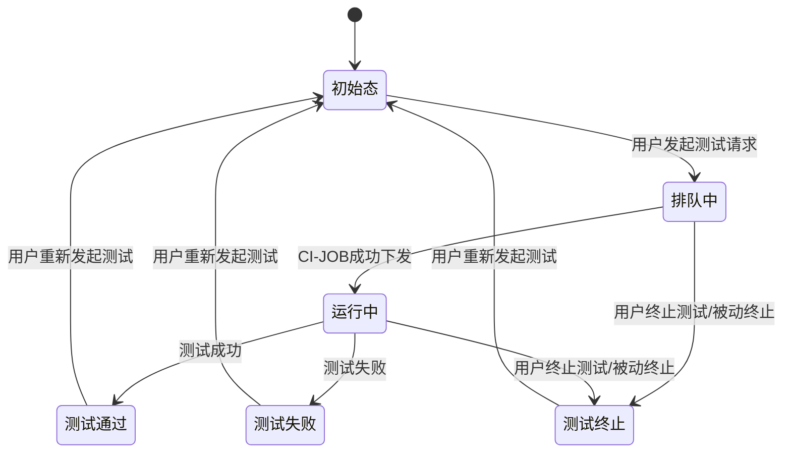
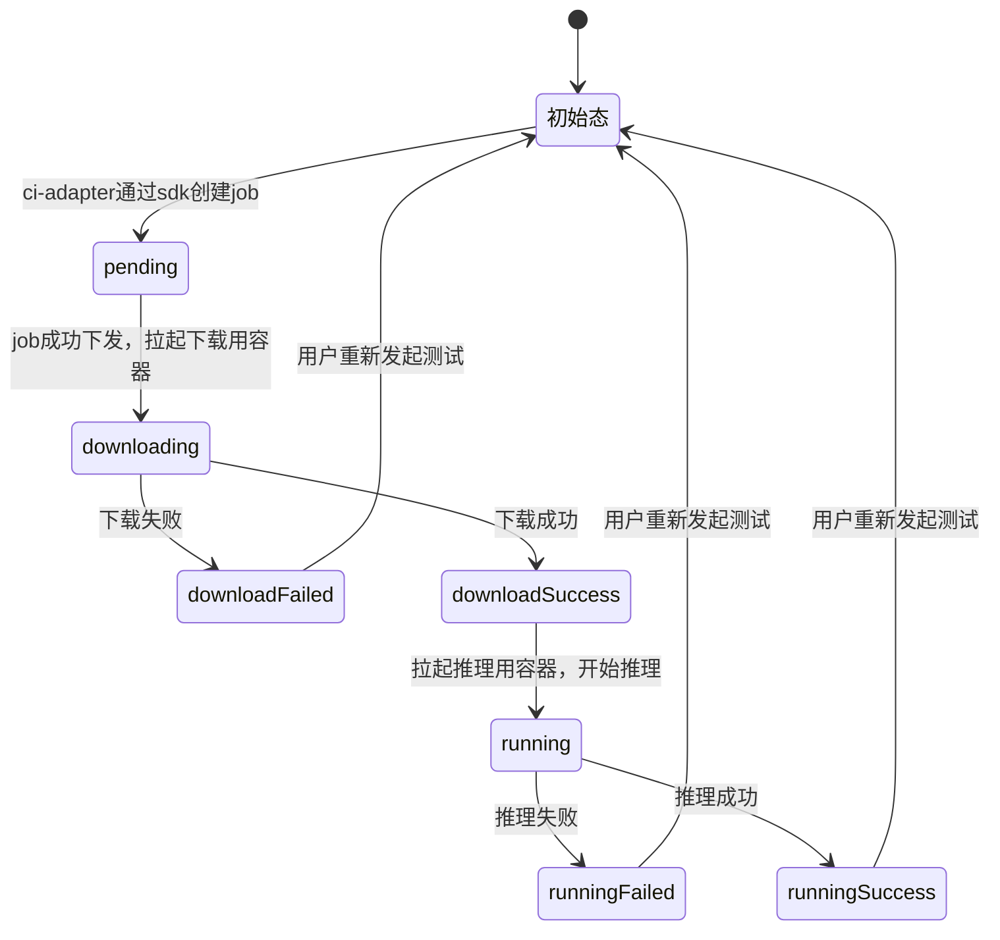
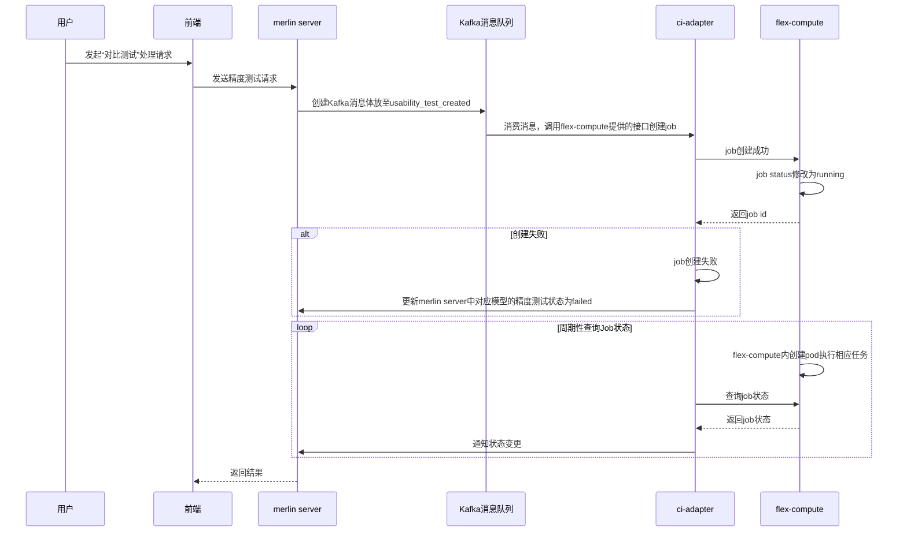
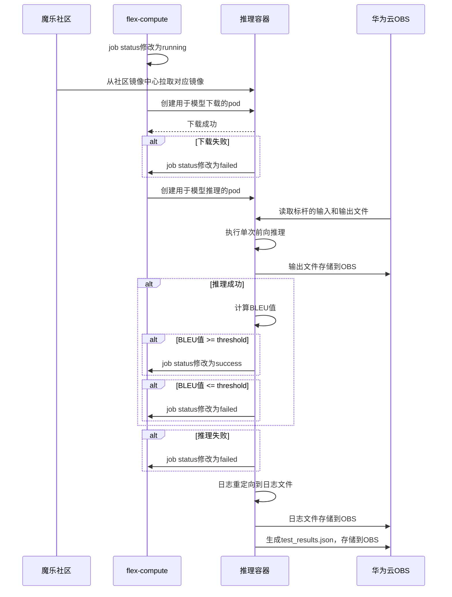
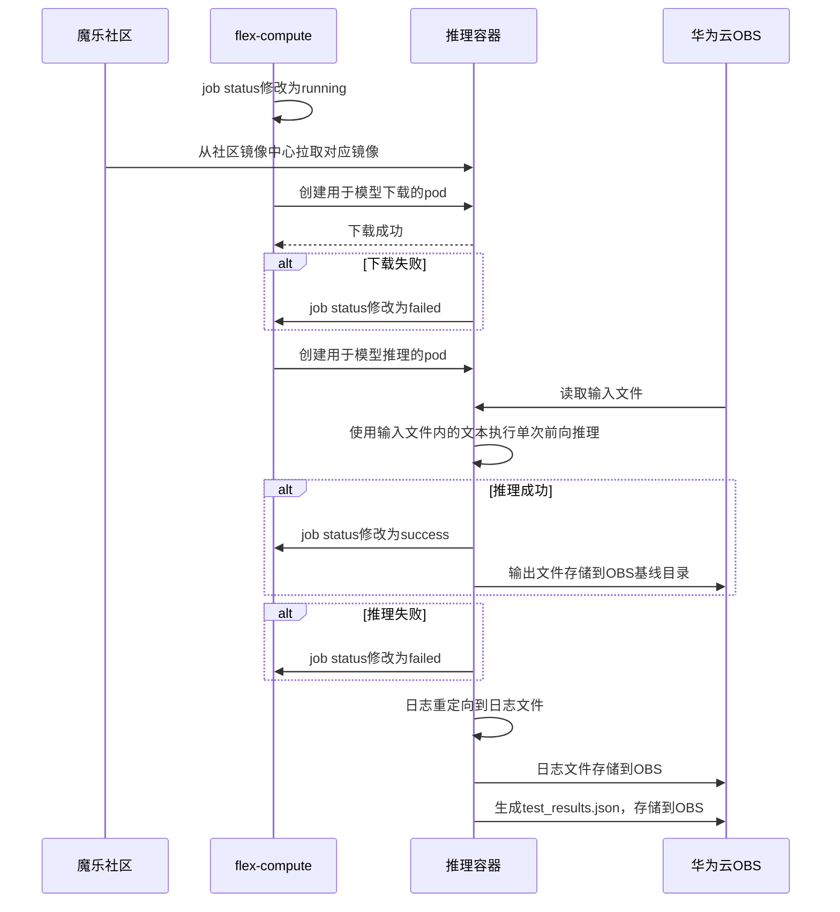
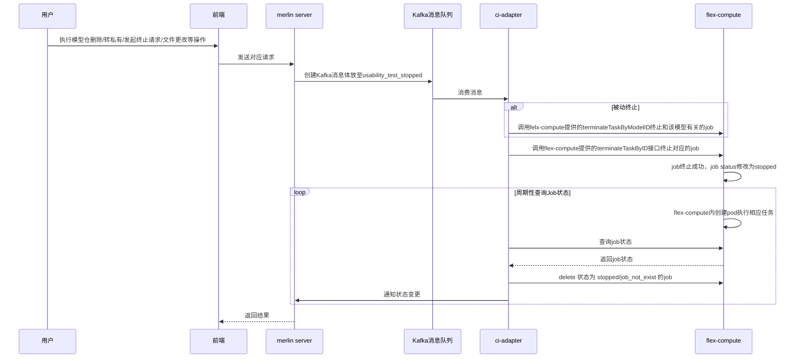

前端状态机



# flex-compute 单个job状态机

### 推理失败原因包含：

- 对比测试
  - 推理脚本或模型问题导致的单次前向推理失败
  - 虽然单次前向推理成功，但是与标杆对比后低于评估标准
- 基线测试
  - 推理脚本或模型问题导致的单次前向推理失败




## Kafka消息接口更改

**原有的模型可用性认证消息命名由 model_ci_created, model_ci_stopped修改为usability_test_created, usability_test_stopped**

accuracy_test_created消息新增字段

| 字段名                   | 类型   | 描述                                                         | 示例值                             | 是否必选 |
| ------------------------ | ------ | ------------------------------------------------------------ | ---------------------------------- | :------: |
| id                       | string | 该精度测试对应的唯一标识符，数据库自增主键                   |                                    |    是    |
| test_type                | string | 区分测试类型（如可用性测试、精度测试）                       | "accuracy_test" \|"usability_test" |    是    |
| model_test_type          | string | 区分基础测试类型（推理或训练）                               | "inference"  \|"training"          |    是    |
| model_template           | string | 精度测试执行所需的模型模板                                   | 见约束对应章节                     |    否    |
| dataset_id               | string | 训练精度测试关联的数据集信息，用于下载数据集                 | "dataset_abc"                      |    否    |
| baseline_id              | string | 训练关联的基线id                                             | "baseline123"                      |    是    |
| metric                   | string | 使用的评估指标                                               | BLEU、绝对误差                     |    是    |
| threshold                | float  | 通过测试的阈值                                               | 0.85                               |    否    |
| operator                 | string | 用于比较的操作符                                             | >=, <=                             |    是    |
| ~~baseline_output_file~~ | string | 精度测试基线输出文本文件/loss文件的路径，用于对比测试        | "/path/to/baseline_output.txt"     |    否    |
| ~~input_file_path~~      | string | 推理精度测试输入文本文件的路径，用于推理测试                 | "/path/to/input.txt"               |    否    |
| ~~baseline_dir_path~~    | string | 已有/预创建的基线目录路径，用于subpath挂载                   | "/path/to/baseline_dir"            |    否    |
| ~~result_dir_path~~      | string | 测试任务的结果目录路径，用于subpath挂载，用于容器存储测试结果物料 | "/path/to/result_dir"              |    是    |
|                          |        |                                                              |                                    |          |
|                          |        |                                                              |                                    |          |


accuary_test_stopped消息新增字段（似乎不需要新增字段）


## 内存数据结构体字段修改

**用于模型可用性认证的内存相关的结构体 ModelInfo 修改为 UsabilityModelInfo**

新增用于精度测试的内存相关结构体 AccuracyModelInfo


当前设计和模型可用性测试共用同一个内存数据结构体

#### AccuracyModelInfo结构体参数

| 字段名           | 类型       | 描述                                   | 示例值                                                       | 是否必选 |
| ---------------- | ---------- | -------------------------------------- | ------------------------------------------------------------ | -------- |
| ID               | int64      | 唯一任务ID                             |                                                              | 是       |
| Owner            | string     | 模型Owner                              | ModelOwner                                                   | 是       |
| ModelName        | string     | 模型名字                               | ModelName-7B                                                 | 是       |
| ModelID          | Int64      | 模型ID                                 |                                                              | 是       |
| ImageName        | string     | 精度测试使用的基础镜像                 | openeuler-python3.10-cann8.0.rc2.beta1-pytorch2.1.0-openmind0.9.0 | 是       |
| GitURL           | string     | 模型的URL                              | https://modelers.cn/ModelOwner/ModelName.git                 | 是       |
| TestStatus       | string     | 测试状态                               | running, pending, etc...                                     | 是       |
| StatusConfirmed  | bool       |                                        |                                                              | 是       |
| LastUpdated      | string     |                                        |                                                              |          |
| HardwareVersion  | string     | 硬件信息                               | NPU                                                          | 是       |
| Framework        | string     | 框架信息                               | pytorch                                                      | 是       |
| FrameworkVersion | string     | 框架版本                               | 2.1.0                                                        | 是       |
| CannVersion      | string     | Cann版本                               | 8.0.rc1.beta1                                                | 是       |
| CommitID         | string     | 模型仓的commit ID                      | 239f776                                                      | 是       |
| IsRepoDeleted    | bool       | 判断Repo是否被删除的标志               | True/False                                                   | 是       |
| CITask           | CITaskInfo |                                        |                                                              | 是       |
| NumComputeCards  | int        | 精度测试所需卡数                       | 1，2，4，8                                                   | 是       |
| TestType         | string     | 区分测试类型（如可用性测试、精度测试） | "accuracy_test" \|"usability_test"                           | 是       |
| ModelTestType    | string     | 区分基础测试类型（推理或训练）         | "inference"  \|"training"                                    | 是       |
| RunAsBaseLine    | bool       | 当前任务是否作为基线运行的标志         | True/False                                                   | 是       |
| ModelTemplate    | string     | 模型Template                           | qwen, internal, etc...                                       | 否       |
| DatasetName      | string     | 精度训练所用的数据集名称               | alpace-demo                                                  | 否       |
| Metric           | string     | 使用的评估指标                         | BLEU、绝对误差                                               | 否       |
| Threshold        | float      | 通过测试的阈值                         | 0.85                                                         | 否       |
| Operator         | string     | 用于比较的操作符                       | >=, <=                                                       | 是       |
| BaseLineName     | string     | 用于对比的基线名称                     | qwen2-0.5b-baseline2                                         | 否       |
|                  |            |                                        |                                                              |          |
|                  |            |                                        |                                                              |          |
|                  |            |                                        |                                                              |          |
|                  |            |                                        |                                                              |          |
|                  |            |                                        |                                                              |          |


#### AccuracyTaskInfo结构体参数

| 字段名         | 类型   | 描述                           | 示例值                     | 是否必选 |
| -------------- | ------ | ------------------------------ | -------------------------- | -------- |
| Status         | string | 获取模型在flex-compute上的状态 | running, success, etc...   | 否       |
| JobID          | string | K8s上对应的JobID               |                            | 是       |
| ReportURL      | string | 日志文件路径                   |                            | 否       |
| NewBaseLineURL | string | 基线URL                        | obs URL                    | 否       |
| TestResultURL  | string | test_result.json文件URL        | obs URL                    | 否       |
| OutputURL      | string | 推理输出文件URL                | obs URL                    | 否       |
| MetricValue    | float  | 使用对应评估输出的得分         | 0.85                       | 否       |
| Passed         | bool   | 用于判断对比测试是否通过的标志 | True/False                 | 否       |
| Stage          | string | 测试处在的阶段                 | pending/download/inference | 否       |
|                |        |                                |                            |          |
|                |        |                                |                            |          |


## 通知merlin server模型状态变更

#### 和模型可用性测试共用UpdateModelCI结构体

#### UpdateModelCI结构体

| 字段名           | 类型   | 描述                      | 示例值 | 是否必选 |
| ---------------- | ------ | ------------------------- | ------ | -------- |
| Id               | int64  | 任务id                    |        | 是       |
| ModelId          | int64  | 数据库内模型自增id        |        | 是       |
| CommitId         | string | commit id                 |        | 是       |
| CiStatus         | string | ci状态                    |        | 是       |
| ResultURL        | string | 日志URL（模型可用性测试） |        | 否       |
| ExternalArgsInfo | string | 一个结构体                |        | 是       |


#### ExternalArgsInfo原有字段

| 字段名          | 类型   | 描述                      | 示例值                 | 是否必选 |
| --------------- | ------ | ------------------------- | ---------------------- | -------- |
| ImageName       | string | 镜像名称                  |                        | 是       |
| JobID           | string | job id                    |                        | 是       |
| Status          | string | ci状态                    | running/success/failed | 是       |
| ReportURL       | string | 日志URL（模型可用性测试） |                        | 否       |
| StatusConfirmed | bool   | 状态确认位                |                        | 是       |
|                 |        |                           |                        |          |


#### ExternalArgsInfo新增字段

| 字段名      | 类型   | 描述                                           | 示例值                     | 是否必选 |
| ----------- | ------ | ---------------------------------------------- | -------------------------- | -------- |
| Stage       | string | 任务阶段                                       | pending/download/inference | 是       |
| OutputURL   | string | 推理输出文件路径                               | obs URL                    | 否       |
| LogURL      | string | 日志路径                                       | obs URL                    | 否       |
| Passed      | bool   | 精度测试是否通过                               | True/False                 | 否       |
| MetricValue | float  | 对比测试时，计算得到的指标值（仅对比测试需要） | 0.85                       | 否       |
| UpdatedDate | date   | 更新时间                                       |                            | 是       |
|             |        |                                                |                            |          |
|             |        |                                                |                            |          |


# 发起推理精度测试

## 前端/merlin server/kafka/ci-adapter/flex-compute之间的交互

#### 发起精度测试流程概述：

1. 用户发起测试的处理请求
2. 前端向merlin server发起精度测试请求
3. merlin通过Kafka发送消息
4. ci-adapter消费Kafka消息，调用flex-compute暴露的job create接口创建job，创建成功返回值包含job id。若失败，直接更新merlin中对应模型的精度测试状态为failed
5. ci-adapter周期性查询内存中保存的job的状态，得到job状态后，通知merlin状态变更
6. merlin返回结果给前端





## flex-compute/obs/社区之间的交互

### 大致流程

1. 容器启动

   - 获取环境变量:
     - MODEL_OWNER: 模型拥有者
     - MODEL_NAME: 模型名称
     - MODEL_TEMPLATE: 模型模版
     - INPUT_FILE_PATH: 输入文本文件路径
     - BASELINE_OUTPUT_FILE: 基准输出文件

2. 下载模型

   - 使用openmind-hub sdk，根据MODEL_OWNER和MODEL_NAME下载模型到本地路径
   - 下载输入文本文件

3. 执行推理

   - 对比测试

     - 读取环境变量中的INPUT_FILE_PATH，将文件内容作为输入

     - 使用openmind-cli执行单次前向推理

     - 计算推理输出文本与基线输出文本的BLEU值，并与阈值比较判断测试是否通过

     - 将输出文本存入OBS对应的基线目录

   - 基线测试

     - 读取环境变量中的INPUT_FILE_PATH，将文件内容作为输入

     - 使用openmind-cli执行单次前向推理

4. 日志处理

   - 推理过程中的打屏日志重定向到文件
   - 生成test_results.json文件
   - 将日志文件和test_result.json文件上传至OBS


```pseudocode
# test_result.json sample
# comparison_datails字段当"is_comparison_test": true 时才会存在
{
  "baseline_id": "baseline_123",
  "is_comparison_test": true,
  "test_type": "inference",
  "stage": "test",
  "output": "output.txt",
  "log": "execution.log",
  "passed": true,
  "comparison_details": {
    "metric": "BLEU",
    "metric_value": 0.85,
    "threshold": 0.80,
    "operator": ">="
  }
}
```


对比测试




作为基准测试




## 终止推理精度测试（涵盖发起终止请求/模型仓删除/转私有/文件更改）

#### 流程概述：

1. 用户主动发起终止精度测试的处理请求/被动发起终止的请求
2. 前端向merlin server发起终止请求
3. merlin通过Kafka发送消息
4. ci-adapter消费Kafka消息
   - 主动终止
     - 调用flex-compute暴露的job create接口根据job id终止对应的job
   - 被动终止
     - 调用相关接口终止和该模型有关的job

5. ci-adapter周期性查询内存中保存的job的状态，得到job状态后，通知merlin状态变更
6. merlin返回结果给前端





## 精度测试执行测伪代码

输入：OWNER, MODEL_NAME,  BASELINE_NAME, NEW_BASELINE_NAME, METRIC, THRESHOLD, OPERATOR, TEST_TYPE, MODEL_TEST_TYPE, RUN_AS_BASELINE, INPUT_FILE_PATH, TEST_ID


```python
#推理代码   
def inference_for_accuracy():
  model_path = f"/home/openmind/data/.cache/{OWNER/MODEL_NAME}/snapshot/commit-id"
  obs_root_path = f"/root_path/results"
  # 执行推理
  pipe = openmind.pipeline(model_path)
  benchmark_input=file_reader("input_benchmark.txt")
  # 确定随机性种子，使多次推理输出能保持一致
  output = pipe(benchmark_input)
  file_writer("output.txt", output)
  benchmark_output = file_reader("output_benchmark.txt")
  # 通过环境变量METRIC判断使用的评估方法，对基线输出和pipeline的到的输出进行对比输出得分
  metric_val = compute_metric(metric, output, benchmark_output)
  # 根据metric_val, threshold, operator等判断精度测试是否成功，并生成test_results文件需要的对应json格式字符串
  test_results = generate_result_file(metric, metric_val, threshold, operator)
  file_writer("test_results.json", test_results)
  
  upload_files_to_obs("output.txt", "log.log", "test_results.json")
  
```


#### OBS文件存放路径

```apl
/{root_path}/
├──results/
│  ├── {accuracy_test_id}/
│  │  ├── test_results.json
│  │  ├── output.txt
│  │  └── log.log
└──baselines/
   ├── {model_id}/
    	├── inference/
    	│	 ├── {baseline_id}/
    	│	 │  ├── input.txt
    	│	 │  └── output.txt
      └── training/
         ├── {baseline_id}/
         │   └── loss.jsonl
```


#### 内存内通过flex-compute sdk返回的任务状态对是否通过精度测试进行判断


| ci-adapter内存处状态位 | flex-compute job状态位       |
| ---------------------- | ---------------------------- |
| success                | runningSuccess               |
| failed                 | downloadFailed/runningFailed |
| running                | running                      |
| stopped                | stopped                      |
|                        |                              |


#### 由于flex-compute sdk返回的job运行完的状态只有runningSuccess和runningFailed，没有更加细粒度的状态划分。因此当前设计为ci-adapter中查询到job状态为runningSuccess后，即表示流程跑通+与标杆比较成功

- flex-compute的runningSuccess意味着流程跑通+与标杆比较成功，与精度测试是否合格无关。
- flex-compute返回runningFailed意味着3个流程中有一个失败（下载失败，推理失败，对比测试失败）
- flex-compute返回为runningFailed时：
  - 下载失败/推理失败：
    - comparison_details = nil
    - output = nil
    - passed = nil
    - log = "/path/to/your/log"
  - 对比失败：
    - comparison_detals  不为空
    - passed = false
    - output = "/path/to/your/output"
    - Log = "/path/to/your/log"


```go
"{
  "baseline_id": "baseline_123",
  "is_comparison_test": true,
  "test_type": "inference",
  "stage": "test",
  "output": "output.txt",
  "log": "execution.log",
  "passed": true,
  "comparison_details": {
    "metric": "BLEU",
    "metric_value": 0.85,
    "threshold": 0.80,
    "operator": ">="
  }
}"


// 当flex-compute返回job状态为success时，调用该方
func (ami *AccuracyModelInfo) accuracy_test_inspector() {
  // 内存中的status只有 success, failed(runningFailed and downloadFailed included), running, stopped
  test_result = download(/obs_endpoint/accuracy_test_id/test_result.json)	

  ami.TaskInfo{
    ReportURL: test_result.log
    OutputURL: test_result.output
    MetricValue: test_result.comparison_details.metric_value
    Passed: test_result.passed
  }
}


// 当flex-compute返回job状态为failed时，调用该方法
func (ami *AccuracyModelInfo) IsRunningFailure() {
  test_result = download(/obs_endpoint/accuracy_test_id/test_result.json)	
  // 如果test_result.json存在，说明执行侧全流程运行成功，为精度对比失败
  if isFileExisted() {
    ami.TaskInfo{
      OutputURL: test_result.output
      MetricValue: test_result.comparison_details.metric_value
      Passed: test_result.passed
    }
  } else {
    // outputURL, metricValue, Passed等置空，只返回log URL
    ami.TaskInfo{
      reportURL: reportURL
    }
  }
 }
}
```


