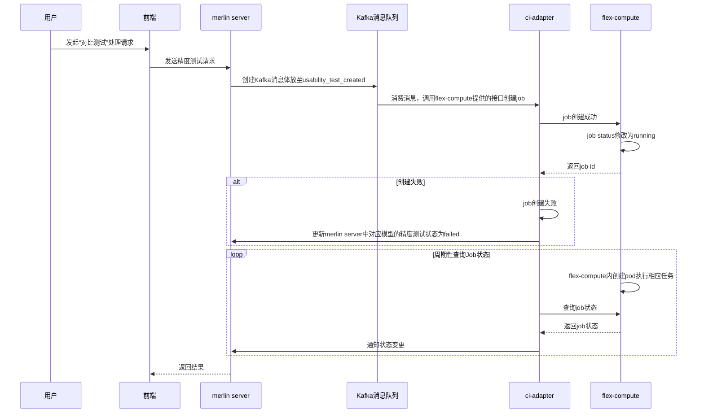
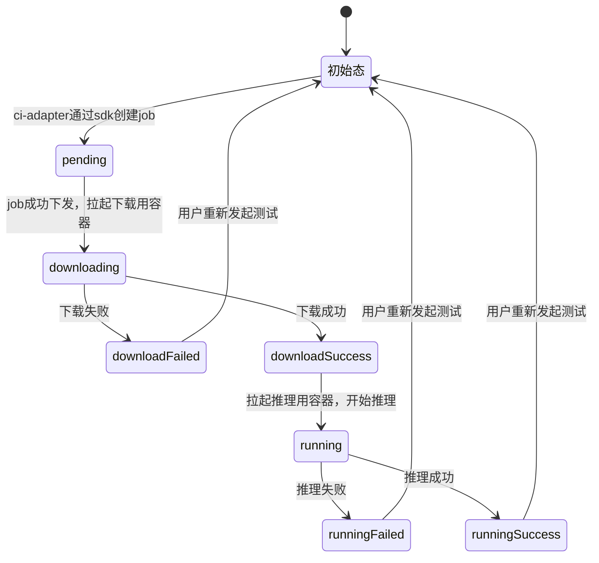
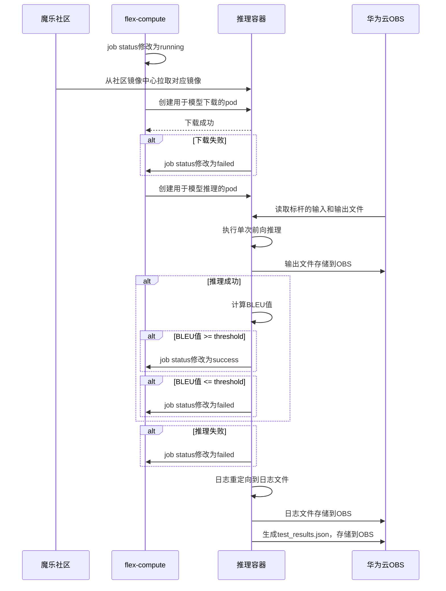
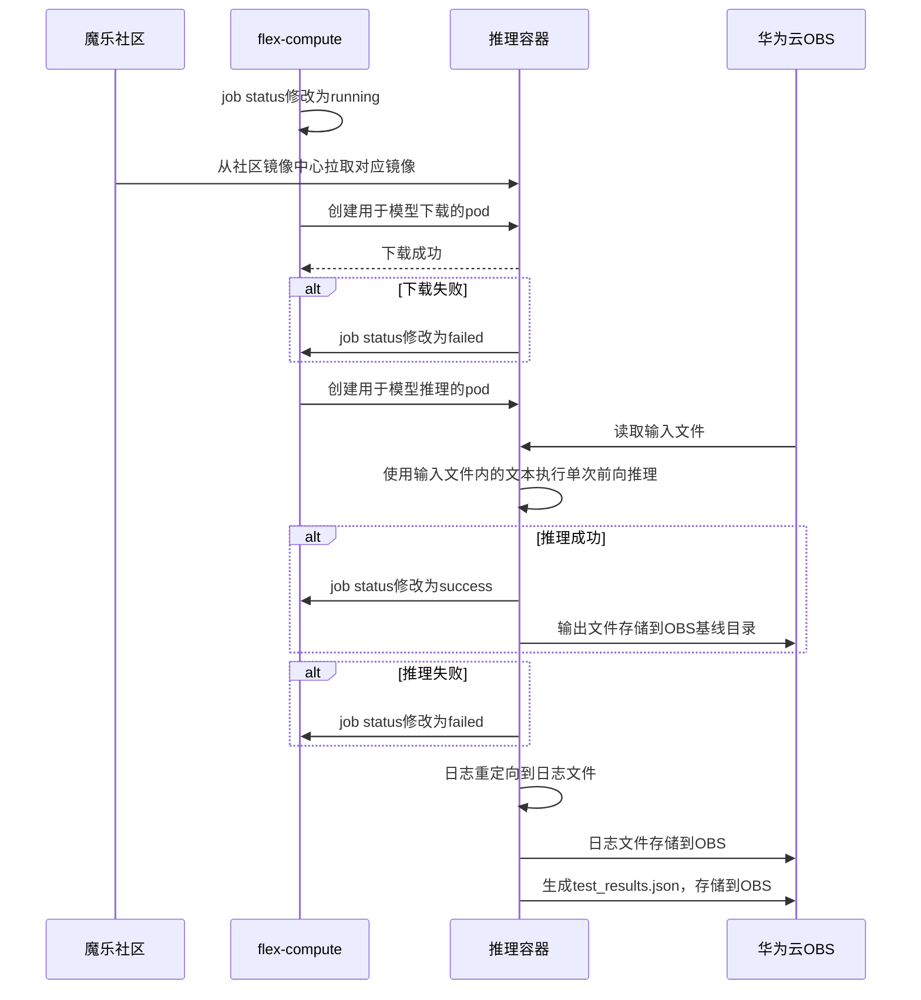
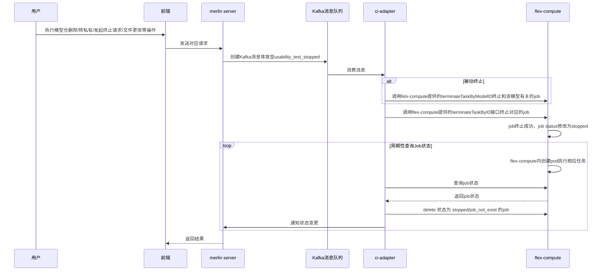

# 社区模型精度测试详设文档

## 模型精度测试介绍

### 背景

魔乐社区新增支持模型精度对比测试，推理场景，支持文生文(text-generation) 相关模型发起对比测试。精度测试支持基于用户导入的GPU基线数据进行比对测试，支持推理输出比对，支持NPU上测试作为基线运行生成新基线，且针对不同规模的模型支持单机多卡分布式训练

### 价值

精度测试作为基础的测试策略，支持通过测试的策略组合，进行生态模型，精品模型的多样性测试组合。


## 结构体新增/变更

### Kafka消息接口结构体

#### 新增

#### accuracy_test_created消息字段

| 字段名           | 类型    | 描述                                         | 示例值                                                       | 是否必选 |
| ---------------- | ------- | -------------------------------------------- | ------------------------------------------------------------ | :------: |
| id               | string  | 该精度测试对应的唯一标识符，数据库自增主键   |                                                              |    是    |
| TestType         | string  | 区分测试类型（如可用性测试、精度测试）       | "accuracy_test" \|"usability_test"                           |    是    |
| ModelTestType    | string  | 区分基础测试类型（推理或训练）               | "inference"  \|"training"                                    |    是    |
| ModelTemplate    | string  | 精度测试执行所需的模型模板                   | 见约束对应章节                                               |    否    |
| DatasetID        | string  | 训练精度测试关联的数据集信息，用于下载数据集 | "dataset_abc"                                                |    否    |
| BaselineID       | Int64   | 训练关联的基线id                             |                                                              |    是    |
| BaselineName     | string  | 训练关联的基线名称                           | "baseline_1"                                                 |    否    |
| Metric           | float64 | 使用的评估指标                               | BLEU、绝对误差                                               |    否    |
| Threshold        | float64 | 通过测试的阈值                               | 0.85                                                         |    否    |
| Operator         | string  | 用于比较的操作符                             | >=, <=                                                       |    是    |
| ModelID          | int64   | 测试所需要的模型对应的唯一ID                 |                                                              |    是    |
| Owner            | string  | 模型Owner                                    |                                                              |    是    |
| ModelName        | string  | 模型名称                                     |                                                              |    是    |
| ImageName        | string  | 测试所需要的镜像名称                         | openeuler-python3.10-cann8.0.rc2.beta1-pytorch2.1.0-openmind0.9.0 |    是    |
| GitURL           | string  | 模型对应的git url                            | https://modelers.cn/ModelOwner/ModelName.git                 |    是    |
| CommitID         | string  | 模型对应的某一commit id                      |                                                              |    是    |
| HardwareVersion  | string  | 硬件信息                                     | NPU                                                          |    是    |
| Framework        | string  | 框架信息                                     | pytorch                                                      |    是    |
| FrameworkVersion | string  | 框架版本                                     | 2.1.0                                                        |    是    |
| CannVersion      | string  | Cann版本                                     | 8.0.rc1.beta1                                                |    是    |
| IsPubToPri       | bool    | 判断Repo是否由公转私                         | True/False                                                   |    是    |
| IsRepoDeleted    | bool    | 判断Repo是否被删除的标志                     | True/False                                                   |    是    |
| NumComputeCards  | int     | 精度测试所需卡数                             | 1，2，4，8                                                   |    是    |


#### 变更

原有的模型可用性认证消息命名由 model_ci_created, model_ci_stopped修改为usability_test_created, usability_test_stopped


### 内存数据结构体

#### 新增

#### AccuracyModelInfo结构体参数

| 字段名           | 类型             | 描述                                   | 示例值                                                       | 是否必选 |
| ---------------- | ---------------- | -------------------------------------- | ------------------------------------------------------------ | -------- |
| ID               | int64            | 唯一任务ID                             |                                                              | 是       |
| Owner            | string           | 模型Owner                              | ModelOwner                                                   | 是       |
| ModelName        | string           | 模型名字                               | ModelName-7B                                                 | 是       |
| ModelID          | Int64            | 模型ID                                 |                                                              | 是       |
| ImageName        | string           | 精度测试使用的基础镜像                 | openeuler-python3.10-cann8.0.rc2.beta1-pytorch2.1.0-openmind0.9.0 | 是       |
| GitURL           | string           | 模型的URL                              | https://modelers.cn/ModelOwner/ModelName.git                 | 是       |
| TestStatus       | string           | 测试状态                               | running, pending, etc...                                     | 是       |
| StatusConfirmed  | bool             |                                        |                                                              | 是       |
| LastUpdated      | string           |                                        |                                                              |          |
| HardwareVersion  | string           | 硬件信息                               | NPU                                                          | 是       |
| Framework        | string           | 框架信息                               | pytorch                                                      | 是       |
| FrameworkVersion | string           | 框架版本                               | 2.1.0                                                        | 是       |
| CannVersion      | string           | Cann版本                               | 8.0.rc1.beta1                                                | 是       |
| CommitID         | string           | 模型仓的commit ID                      | 239f776                                                      | 是       |
| IsRepoDeleted    | bool             | 判断Repo是否被删除的标志               | True/False                                                   | 是       |
| CITask           | CITaskInfo       |                                        |                                                              | 是       |
| NumComputeCards  | int              | 精度测试所需卡数                       | 1，2，4，8                                                   | 是       |
| TestType         | string           | 区分测试类型（如可用性测试、精度测试） | "accuracy_test" \|"usability_test"                           | 是       |
| ModelTestType    | string           | 区分基础测试类型（推理或训练）         | "inference"  \|"training"                                    | 是       |
| RunAsBaseLine    | bool             | 当前任务是否作为基线运行的标志         | True/False                                                   | 是       |
| ModelTemplate    | string           | 模型Template                           | qwen, internal, etc...                                       | 否       |
| DatasetName      | string           | 精度训练所用的数据集名称               | alpace-demo                                                  | 否       |
| Metric           | string           | 使用的评估指标                         | BLEU、绝对误差                                               | 否       |
| Threshold        | float            | 通过测试的阈值                         | 0.85                                                         | 否       |
| Operator         | string           | 用于比较的操作符                       | >=, <=                                                       | 是       |
| BaseLineName     | string           | 用于对比的基线名称                     | qwen2-0.5b-baseline2                                         | 否       |
| CiTask           | AccuracyTaskInfo | 精度测试相关的信息                     |                                                              | 是       |


#### AccuracyTaskInfo结构体参数

| 字段名         | 类型   | 描述                           | 示例值                     | 是否必选 |
| -------------- | ------ | ------------------------------ | -------------------------- | -------- |
| Status         | string | 获取模型在flex-compute上的状态 | running, success, etc...   | 否       |
| JobID          | string | K8s上对应的JobID               |                            | 是       |
| ReportURL      | string | 日志文件路径                   |                            | 否       |
| NewBaseLineURL | string | 基线URL                        | obs URL                    | 否       |
| TestResultURL  | string | test_result.json文件URL        | obs URL                    | 否       |
| OutputURL      | string | 推理输出文件URL                | obs URL                    | 否       |
| MetricValue    | float  | 使用对应评估输出的得分         | 0.85                       | 否       |
| Passed         | bool   | 用于判断对比测试是否通过的标志 | True/False                 | 否       |
| Stage          | string | 测试处在的阶段                 | pending/download/inference | 否       |


#### 变更

用于模型可用性认证的内存相关的结构体 ModelInfo 修改为 UsabilityModelInfo


### merlin server模型状态结构体

#### 新增

#### UpdateAccuracyCI结构体

| 字段名                   | 类型   | 描述                                          | 示例值 | 是否必选 |
| ------------------------ | ------ | --------------------------------------------- | ------ | -------- |
| Id                       | int64  | 任务id                                        |        | 是       |
| ModelId                  | int64  | 数据库内模型自增id                            |        | 是       |
| CommitId                 | string | commit id                                     |        | 是       |
| CiStatus                 | string | ci状态                                        |        | 是       |
| ResultURL                | string | 日志URL（模型可用性测试）                     |        | 否       |
| AccuracyExternalArgsInfo | string | merlin server端需要的数据被整合到这个结构体中 |        | 是       |


#### AccuracyExternalArgsInfo字段

| 字段名          | 类型    | 描述                                   | 示例值                                                       | 是否必选 |
| --------------- | ------- | -------------------------------------- | ------------------------------------------------------------ | -------- |
| ImageName       | string  | 镜像名称                               | openeuler-python3.10-cann8.0.rc2.beta1-pytorch2.1.0-openmind0.9.0 | 是       |
| JobID           | string  | job id                                 |                                                              | 是       |
| Status          | string  | ci状态                                 | running/success/failed                                       | 是       |
| ReportURL       | string  | 日志URL（模型可用性测试）              |                                                              | 否       |
| StatusConfirmed | bool    | 状态确认位                             | True/False                                                   | 是       |
| Stage           | string  | 测试所处stage                          | downloading/infer/train                                      | 是       |
| OutputFileURL   | string  | 输出文件URL                            |                                                              | 否       |
| LogFileURL      | string  | 日志文件URL                            |                                                              | 否       |
| Passed          | bool    | 用于告知测试是否通过的判断标志         | True/False                                                   | 是       |
| MetricValue     | float64 | 对比得到的得分                         | 0.75                                                         | 否       |
| Metric          | string  | 精度对比所用的方法                     | BLEU                                                         | 是       |
| Threshold       | float64 | 阈值                                   | 0.85                                                         | 否       |
| BaseLineID      | int64   | 基线唯一ID                             |                                                              | 否       |
| BaseLineName    | string  | 基线名称                               |                                                              | 否       |
| TestType        | string  | 区分测试类型（如可用性测试、精度测试） | "accuracy_test" \|"usability_test"                           | 是       |


## 推理精度测试发起流程

### 精度测试发起流程概述

1. 用户发起测试的处理请求
2. 前端向merlin server发起精度测试请求
3. merlin通过Kafka发送消息
4. ci-adapter消费Kafka消息，调用flex-compute暴露的job create接口创建job，创建成功返回值包含job id。若失败，直接更新merlin中对应模型的精度测试状态为failed
5. ci-adapter周期性查询内存中保存的job的状态，得到job状态后，通知merlin状态变更
6. merlin返回结果给前端





## 精度测试执行侧流程

### 整体流程

1. 容器启动

   - 获取环境变量:
     - MODEL_OWNER: 模型拥有者
     - MODEL_NAME: 模型名称
     - COMMIT_ID: commit ID
     - MODEL_TEMPLATE: 模型模版
     - TEST_TYPE: 测试类型（可用性或精度测试）
     - MODEL_TEST_TYPE: 基础测试类型（推理或训练）
     - RUN_AS_BASELINE: 是否作为基线运行
     - BASELINE_NAME: 基线名称
     - BASELINE_ID: 基线对应的唯一ID
     - METRIC: 精度对比策略（BLEU，Accuracy...）
     - THRESHOLD: 阈值大小
     - OPERATOR: 与阈值对比符号（>=, <=）
     - BUCKET_NAME: obs对应的bucket name
     - ENDPOINT: obs对应的endpoint
     - ACCURACY_TEST_ID: 精度测试对应的唯一ID
     - INPUT_FILE_NAME: 输入文本文件名称
     - INPUT_FILE_PATH: 输入文本文件路径
     - OUTPUT_FILE_NAME: 输出文本文件名称
     - OUTPUT_FILE_PATH: 输出文本文件路径
2. 下载模型

   - 使用openmind-hub sdk，根据MODEL_OWNER，MODEL_NAME和COMMIT_ID下载模型到本地路径
3. 执行推理

   - 对比测试

     - 读取环境变量中的INPUT_FILE_PATH，将文件内容作为输入

     - 读取OUTPUT_FILE_PATH文件，作为标杆

     - 使用openmind-cli执行单次前向推理

     - 计算推理输出文本与基线输出文本的BLEU值，并与阈值比较判断测试是否通过

     - 将输出文本存入OBS对应的基线目录

   - 基线测试

     - 读取环境变量中的INPUT_FILE_PATH，将文件内容作为输入

     - 使用openmind-cli执行单次前向推理
4. 日志处理

   - 推理过程中的打屏日志重定向到文件
   - 生成test_results.json文件
   - 将日志文件和test_result.json文件上传至OBS


```pseudocode
# test_result.json sample
# comparison_datails字段当"is_comparison_test": true 时才会存在
{
  "baseline_id": "baseline_123",
  "is_comparison_test": true,
  "test_type": "inference",
  "stage": "test",
  "output": "output.txt",
  "log": "execution.log",
  "passed": true,
  "comparison_details": {
    "metric": "BLEU",
    "metric_value": 0.85,
    "threshold": 0.80,
    "operator": ">="
  }
}
```


### 执行侧Job状态机



#### 推理失败原因

- 模型等文件下载失败

- 对比测试
  - 推理脚本或模型问题导致的单次前向推理失败
  - 虽然单次前向推理成功，但是与标杆对比后低于评估标准
- 基线测试
  - 推理脚本或模型问题导致的单次前向推理失败


### OBS文件存放路径

```apl
/{root_path}/
├──results/
│  ├── {accuracy_test_id}/
│  │  ├── test_results.json
│  │  ├── output.txt
│  │  └── log.log
└──baselines/
   ├── {model_id}/
    	├── inference/
    	│	 ├── {baseline_id}/
    	│	 │  ├── input.txt
    	│	 │  └── output.txt
      └── training/
         ├── {baseline_id}/
         │   └── loss.jsonl
```


### 对比测试流程图




### 基准测试流程图




## 推理精度终止流程（发起终止请求/模型仓删除/转私有/文件更改）

### 整体流程

1. 用户主动发起终止精度测试的处理请求/被动发起终止的请求
2. 前端向merlin server发起终止请求
3. merlin通过Kafka发送消息
4. ci-adapter消费Kafka消息
   - 主动终止
     - 调用flex-compute暴露的job create接口根据job id终止对应的job
   - 被动终止
     - 调用相关接口终止和该模型有关的job

5. ci-adapter周期性查询内存中保存的job的状态，得到job状态后，通知merlin状态变更
6. merlin返回结果给前端

### 流程图




## 精度测试执行侧(flex-compute)实现

### 环境变量

OWNER, MODEL_NAME,  BASELINE_NAME, NEW_BASELINE_NAME, METRIC, THRESHOLD, OPERATOR, TEST_TYPE, MODEL_TEST_TYPE, RUN_AS_BASELINE, INPUT_FILE_PATH, TEST_ID

### 主要方法

```python
def inference_for_accuracy(owner, model_name, commit_version_id, run_as_baseline, baseline_name, baseline_id, metric, model_test_type, threshold, operator, dest_path):
    model_cache_path=f"/home/openmind/data/models--{owner}--{model_name}/snapshots/{commit_version_id}"
    # TODO: How to infer with different models using an pipeline interface from openmind
    logging.info("Pipeline is running...")
    try:
        with open(f"/home/openmind/benchmark/{INPUT_FILE_NAME}", "r") as f:
            logging.info("Reading baseline input")
            input_benchmark = f.read()
            logging.info(f"Baseline input: {input_benchmark}")
    except Exception as e:
        logging.error(f"Read baseline input read failed: {e}")
        raise Exception(f"Read baseline input read failed: {e}")
    logging.info("Read baseline input success")

    try:
        if NUM_COMPUTE_CARDS == "1":
            pipe = pipeline(model=model_cache_path, task="text-generation", device="npu:0", trust_remote_code=True,
                            framework="pt")
        else:
            pipe = pipeline(model=model_cache_path, task="text-generation", device_map="auto", trust_remote_code=True,
                            framework="pt")
        output = pipe(input_benchmark, max_length=128, num_return_sequences=1)
        logging.info(f"output: {output}")
        output = output[0]["generated_text"]
    except Exception as e:
        logging.error(f"Pipeline running failed: {e}")
        raise Exception(f"Pipeline running failed: {e}")

    logging.info(f"Pipeline running success.")


    try:
        with open("/home/openmind/test_output/output.txt", "w") as f:
            f.write(output)
    except Exception as e:
        logging.error(f"Write pipeline output failed: {e}")
        raise Exception(f"Write pipeline output failed:{e}")

    logging.info(f"Comparing with baseline {baseline_name} using {metric}.")


    try:
        output_benchmark = preprocess_file(f"/home/openmind/benchmark/{OUTPUT_FILE_NAME}")
        logging.info(f"Baseline output: {output_benchmark}")

    except Exception as e:
        logging.error(f"Read output from baseline {baseline_name} failed: {e}")
        raise Exception(f"Read output from baseline {baseline_name} failed: {e}")

    output = preprocess_file(f"/home/openmind/test_output/output.txt")
    logging.info(f"Pipeline output: {output}")

    logging.info("Read baseline output success")
    logging.debug(f"encode output from pipeline and baseline {baseline_name}.")
    tokenizer = AutoTokenizer.from_pretrained(model_cache_path, trust_remote_code=True)
    output = tokenizer.tokenize(output)
    output_benchmark = tokenizer.tokenize(output_benchmark)

    output = " ".join(output)
    output_benchmark = " ".join(output_benchmark)

    try:
        logging.info(f"output: {output}")
        logging.info(f"baseline output: {output_benchmark}")
        result = metric_method(metric, [output], [[output_benchmark]])
        result = round(result / 100, 2)

    except Exception as e:
        logging.error(f"metric compute with baseline {baseline_name} failed: {e}")
        raise Exception(f"metric compute with baseline {baseline_name} failed: {e}")


    passed = accuracy_test_comparator(threshold, result, operator)
    passed_str = "passed" if passed else "failed"
    logging.info(f"Comparing with baseline {baseline_name} done, accuracy test {passed_str}")


    test_result_generator(int(baseline_id), True, model_test_type, "test", dest_path, passed, metric, result, float(threshold), operator)
    
    if not passed:
        logging.info(f"Comparing with baseline {baseline_name} failed")
        exit(1)
  
```


## ci-adapter-server判断精度测试结果

### 内存状态位与执行测状态位对照表

内存内通过flex-compute sdk返回的任务状态对是否通过精度测试进行判断

| ci-adapter内存处状态位 | flex-compute job状态位       |
| ---------------------- | ---------------------------- |
| success                | runningSuccess               |
| failed                 | downloadFailed/runningFailed |
| running                | running                      |
| stopped                | stopped                      |
|                        |                              |


### 测试真实结果判断逻辑

由于flex-compute sdk返回的job运行完的状态只有runningSuccess和runningFailed，没有更加细粒度的状态划分。因此当前设计为ci-adapter中查询到job状态为runningSuccess后，即表示流程跑通+与标杆比较成功

- flex-compute的runningSuccess意味着流程跑通+与标杆比较成功，与精度测试是否合格无关。
- flex-compute返回runningFailed意味着3个流程中有一个失败（下载失败，推理失败，对比测试失败）
- flex-compute返回为runningFailed时：
  - 下载失败/推理失败：
    - comparison_details = nil
    - output = nil
    - passed = nil
    - log = "/path/to/your/log"
  - 对比失败：
    - comparison_detals  不为空
    - passed = false
    - output = "/path/to/your/output"
    - Log = "/path/to/your/log"


```go
"{
  "baseline_id": "baseline_123",
  "is_comparison_test": true,
  "test_type": "inference",
  "stage": "test",
  "output": "output.txt",
  "log": "execution.log",
  "passed": true,
  "comparison_details": {
    "metric": "BLEU",
    "metric_value": 0.85,
    "threshold": 0.80,
    "operator": ">="
  }
}"


// 当flex-compute返回job状态为success时，调用该方
func (ami *AccuracyModelInfo) accuracy_test_inspector() {
  // 内存中的status只有 success, failed(runningFailed and downloadFailed included), running, stopped
  test_result = download(/obs_endpoint/accuracy_test_id/test_result.json)	

  ami.TaskInfo{
    ReportURL: test_result.log
    OutputURL: test_result.output
    MetricValue: test_result.comparison_details.metric_value
    Passed: test_result.passed
  }
}


// 当flex-compute返回job状态为failed时，调用该方法
func (ami *AccuracyModelInfo) IsRunningFailure() {
  test_result = download(/obs_endpoint/accuracy_test_id/test_result.json)	
  // 如果test_result.json存在，说明执行侧全流程运行成功，为精度对比失败
  if isFileExisted() {
    ami.TaskInfo{
      OutputURL: test_result.output
      MetricValue: test_result.comparison_details.metric_value
      Passed: test_result.passed
    }
  } else {
    // outputURL, metricValue, Passed等置空，只返回log URL
    ami.TaskInfo{
      reportURL: reportURL
    }
  }
 }
}
```


