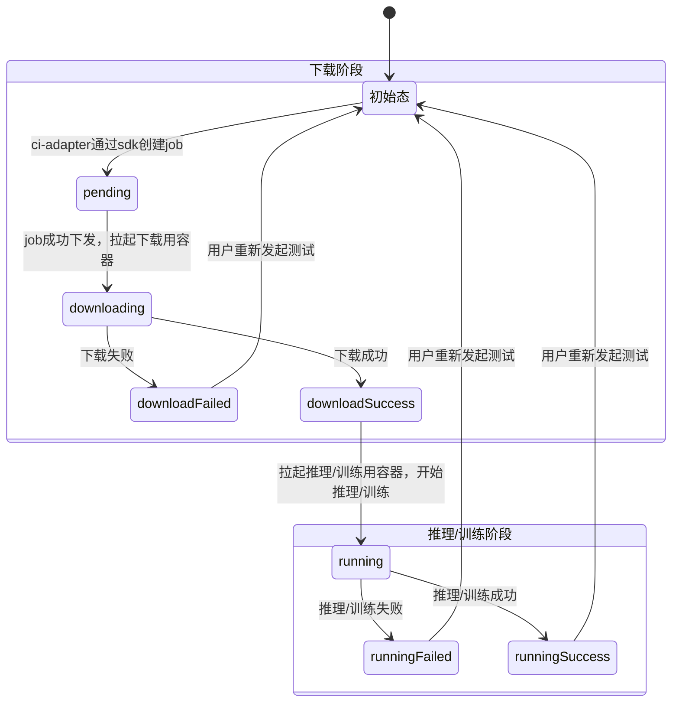

## 执行侧状态图

模型测试分为 下载阶段，推理/训练阶段，见如下状态图

## 问题

#### 下载阶段

| 报错                                                         | 可能原因                                                     |
| ------------------------------------------------------------ | ------------------------------------------------------------ |
| `HTTPSConnectionPool(host="xxxx", port==443),Read timed out` | 网络问题导致的权重下载失败 - 多个下载任务并行导致的下行带宽占满 |
| 模型权重下载到一半中断                                       | 网络问题导致的权重下载失败 - 多个下载任务并行导致的下行带宽占满 |
| 无日志，社区侧显示`系统异常，请稍后再试`                     | 模型下载容器初始化/启动失败 - 容器pvc没有挂上 - ci-infra仓拉取失败（下行带宽占满）  下载阶段日志上传超过最大重试次数（几率较小） - OBS服务出问题 - 上行带宽占满 |

#### 推理阶段

| 报错                                     | 可能原因                                                     |
| ---------------------------------------- | ------------------------------------------------------------ |
| 日志显示下载进度条100%，但任务结果是失败 | 推理阶段容器启动失败 - 容器pvc没有挂上                  |
| 无日志，社区侧显示`系统异常，请稍后再试` | 推理阶段日志上传超过最大重试次数（几率较小） - OBS服务出问题 - 上行带宽占满 |
| pip 报错                                 | - examples/requirements.txt有非法依赖 - 下行带宽占满，pip install 超时 |
| ERROR: inference.py NOT FOUND            | 缺少推理脚本examples/inference.py                            |
| 其他inference.py脚本内报错               | - 脚本代码是否和选择执行测试的环境版本兼容 - 脚本代码本身有问题 - 缺少相关依赖 - 模型参数量太大，显存不足 - 一些模型不支持多卡推理 |

#### 训练阶段

| 报错                                                         | 可能原因                                                     |
| ------------------------------------------------------------ | ------------------------------------------------------------ |
| 无日志，社区侧显示`系统异常，请稍后再试`                     | 推理阶段容器启动失败 - 容器pvc没有挂上  推理阶段日志上传超过最大重试次数（几率较小） - OBS服务出问题 - 上行带宽占满 |
| pip 报错                                                     | - examples/requirements.txt有非法依赖 - 下行带宽占满，pip install 超时 |
| ERROR: Failed to download baseline input file ERROR: Failed to download baseline output file ERROR: Failed to download ground truth loss file | 基线文件下载失败 - OBS服务出问题 - 基线文件已经被删除 |
| [ERROR] This feature requires a minimum version of 1.0.0. Detected openmind==xxx | 精度训练需要openmind 1.0.0及以上版本                         |
| 在 INFO: Train is running" 打印后，INFO: Running script for inference accuracy testing 打印之前报错 | 训练过程中报错 - 缺少相关依赖 - 模型训练显存不足  |